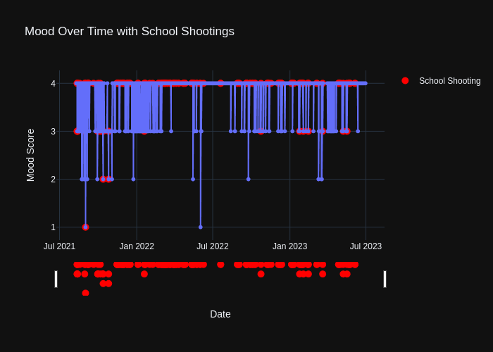

```python
import pandas as pd
import plotly.express as px
```


```python
# Load the CSV file
mood_file_path = 'mood_data.csv'
data = pd.read_csv(mood_file_path)
data.head()
shooting_file_path = 'school-shootings-data.csv' # https://github.com/washingtonpost/data-school-shootings/blob/master/school-shootings-data.csv
school_shooting_data = pd.read_csv(shooting_file_path)
school_shooting_data.head()

```


<div>
<style scoped>
    .dataframe tbody tr th:only-of-type {
        vertical-align: middle;
    }

    .dataframe tbody tr th {
        vertical-align: top;
    }

    .dataframe thead th {
        text-align: right;
    }
</style>
<table border="1" class="dataframe">
  <thead>
    <tr style="text-align: right;">
      <th></th>
      <th>uid</th>
      <th>nces_school_id</th>
      <th>school_name</th>
      <th>nces_district_id</th>
      <th>district_name</th>
      <th>date</th>
      <th>school_year</th>
      <th>year</th>
      <th>time</th>
      <th>day_of_week</th>
      <th>...</th>
      <th>lat</th>
      <th>long</th>
      <th>staffing</th>
      <th>low_grade</th>
      <th>high_grade</th>
      <th>lunch</th>
      <th>county</th>
      <th>state_fips</th>
      <th>county_fips</th>
      <th>ulocale</th>
    </tr>
  </thead>
  <tbody>
    <tr>
      <th>0</th>
      <td>1</td>
      <td>080480000707</td>
      <td>Columbine High School</td>
      <td>804800.0</td>
      <td>Jefferson County R-1</td>
      <td>4/20/1999</td>
      <td>1998-1999</td>
      <td>1999</td>
      <td>11:19 AM</td>
      <td>Tuesday</td>
      <td>...</td>
      <td>39.603910</td>
      <td>-105.075000</td>
      <td>89.6</td>
      <td>9</td>
      <td>12</td>
      <td>41</td>
      <td>Jefferson County</td>
      <td>8</td>
      <td>8059</td>
      <td>21.0</td>
    </tr>
    <tr>
      <th>1</th>
      <td>2</td>
      <td>220054000422</td>
      <td>Scotlandville Middle School</td>
      <td>2200540.0</td>
      <td>East Baton Rouge Parish School Board</td>
      <td>4/22/1999</td>
      <td>1998-1999</td>
      <td>1999</td>
      <td>12:30 PM</td>
      <td>Thursday</td>
      <td>...</td>
      <td>30.529958</td>
      <td>-91.169966</td>
      <td>39.0</td>
      <td>6</td>
      <td>8</td>
      <td>495</td>
      <td>East Baton Rouge Parish</td>
      <td>22</td>
      <td>22033</td>
      <td>12.0</td>
    </tr>
    <tr>
      <th>2</th>
      <td>3</td>
      <td>130441001591</td>
      <td>Heritage High School</td>
      <td>1304410.0</td>
      <td>Rockdale County</td>
      <td>5/20/1999</td>
      <td>1998-1999</td>
      <td>1999</td>
      <td>8:03 AM</td>
      <td>Thursday</td>
      <td>...</td>
      <td>33.626922</td>
      <td>-84.047960</td>
      <td>84.0</td>
      <td>9</td>
      <td>12</td>
      <td>125</td>
      <td>Rockdale County</td>
      <td>13</td>
      <td>13247</td>
      <td>21.0</td>
    </tr>
    <tr>
      <th>3</th>
      <td>4</td>
      <td>421899003847</td>
      <td>John Bartram High School</td>
      <td>4218990.0</td>
      <td>Philadelphia City SD</td>
      <td>10/4/1999</td>
      <td>1999-2000</td>
      <td>1999</td>
      <td>10:00 AM</td>
      <td>Monday</td>
      <td>...</td>
      <td>39.921509</td>
      <td>-75.234108</td>
      <td>41.0</td>
      <td>9</td>
      <td>12</td>
      <td>2007</td>
      <td>Philadelphia County</td>
      <td>42</td>
      <td>42101</td>
      <td>11.0</td>
    </tr>
    <tr>
      <th>4</th>
      <td>5</td>
      <td>250279000225</td>
      <td>Dorchester High School</td>
      <td>2502790.0</td>
      <td>Boston</td>
      <td>11/3/1999</td>
      <td>1999-2000</td>
      <td>1999</td>
      <td>7:40 AM</td>
      <td>Wednesday</td>
      <td>...</td>
      <td>42.285268</td>
      <td>-71.075901</td>
      <td>NaN</td>
      <td>9</td>
      <td>12</td>
      <td>543</td>
      <td>Suffolk County</td>
      <td>25</td>
      <td>25025</td>
      <td>11.0</td>
    </tr>
  </tbody>
</table>
<p>5 rows × 50 columns</p>
</div>


# Data Preparation


```python
import pandas as pd
import plotly.express as px

# Convert date columns to datetime format
data['full_date'] = pd.to_datetime(data['full_date'])
school_shooting_data['date'] = pd.to_datetime(school_shooting_data['date'], format='%m/%d/%Y')

# Define the end date for the visualization (June 30, 2023)
end_date = pd.to_datetime('2023-06-30')

# Filter mood data to only include entries up to the end date
filtered_mood_data = data[data['full_date'] <= end_date]

# Filter school shooting data to only include dates present in filtered mood data
min_date = filtered_mood_data['full_date'].min()
filtered_shooting_data = school_shooting_data[(school_shooting_data['date'] >= min_date) & (school_shooting_data['date'] <= end_date)]

# Create a column to count the number of shootings per day
shooting_counts = filtered_shooting_data.groupby('date').size().reset_index(name='shooting_count')

# Merge the filtered mood data with shooting counts
merged_data = pd.merge(filtered_mood_data, shooting_counts, how='left', left_on='full_date', right_on='date')
merged_data['shooting_count'].fillna(0, inplace=True)

```

# Correlation Visualization


```python
# Map moods to numerical values
mood_mapping = {
    'amazing': 5,
    'good': 4,
    'meh': 3,
    'bad': 2,
    'awful': 1
}
merged_data['mood_score'] = merged_data['mood'].map(mood_mapping)

# Plot mood over time with shooting events
fig = px.line(merged_data, x='full_date', y='mood_score', title='Mood Over Time with School Shootings', markers=True)

# Add shooting events as annotations or secondary markers
shooting_days = merged_data[merged_data['shooting_count'] > 0]

fig.add_scatter(x=shooting_days['full_date'], y=shooting_days['mood_score'],
                mode='markers', marker=dict(size=10, color='red'), name='School Shooting')

# Customize the layout
fig.update_layout(
    xaxis_title='Date',
    yaxis_title='Mood Score',
    yaxis=dict(tickvals=[1, 2, 3, 4, 5]),
    xaxis_rangeslider_visible=True,
    template='plotly_dark'
)

# Show the plot
fig.show()
```



# Statistics


```python
# Correct Total Number of School Shootings
total_shootings = filtered_shooting_data.shape[0]

# Correct Number of Days with School Shootings
days_with_shootings = merged_data[merged_data['shooting_count'] > 0]['full_date'].nunique()

# Display the results
statistics = {
    "Average Mood Score (Days with Shootings)": average_mood_with_shootings,
    "Average Mood Score (Days without Shootings)": average_mood_without_shootings,
    "Total Number of School Shootings": total_shootings,
    "Number of Days with School Shootings": days_with_shootings,
    "Correlation between Mood Score and School Shootings": correlation
}

statistics

```


    {'Average Mood Score (Days with Shootings)': 3.834355828220859,
     'Average Mood Score (Days without Shootings)': 3.8158813263525304,
     'Total Number of School Shootings': 101,
     'Number of Days with School Shootings': 85,
     'Correlation between Mood Score and School Shootings': 0.00452260315774656}


# Conclusion
The analysis shows that the average mood score on days with school shootings (3.83) is slightly higher than on days without them (3.82), though the difference is minimal. The very low correlation (0.0045) between mood score and school shootings suggests no significant relationship. These findings highlight the complexity of emotional responses, where many factors influence mood, and broad data trends may not fully capture individual reactions to such events.
